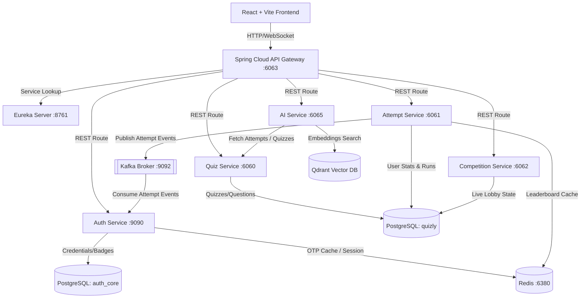
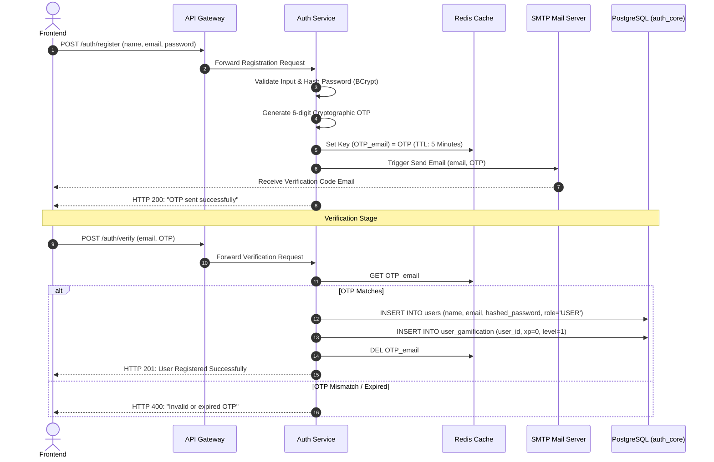
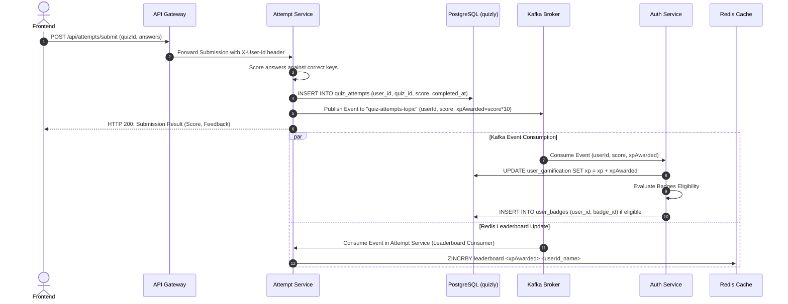

# 🎓 QuizLY Technical Architecture & Interview Prep Master Guide

Welcome to the **QuizLY** technical master guide. This document provides a production-grade, architectural breakdown of the QuizLY microservice ecosystem. Designed for senior engineers, developers, and placement preparation, it reviews every service, functional flow, database schema, security vulnerability, and engineering trade-off across the stack.

---

## 📂 Table of Contents
1. [Phase 1: Complete Architecture Analysis](#phase-1-complete-architecture-analysis)
2. [Phase 2: Complete Functional Flows](#phase-2-complete-functional-flows)
3. [Phase 3: Database Analysis & ER Schemas](#phase-3-database-analysis--er-schemas)
4. [Phase 4: Security Audit & OWASP Top 10](#phase-4-security-audit--owasp-top-10)
5. [Phase 5: Codebase Review & Patterns](#phase-5-codebase-review--patterns)
6. [Phase 6: AI Service Architecture & Spring AI](#phase-6-ai-service-architecture--spring-ai)
7. [Phase 7: Microservice Communication Patterns](#phase-7-microservice-communication-patterns)
8. [Phase 8: Docker & DevSecOps Analysis](#phase-8-docker--devsecops-analysis)
9. [Phase 9: Frontend React+Vite Architecture](#phase-9-frontend-reactvite-architecture)
10. [Phase 10: Observability & Distributed Tracing](#phase-10-observability--distributed-tracing)
11. [Phase 11: Production-Grade Improvements](#phase-11-production-grade-improvements)
12. [Phase 12: Codebase Bug & Fix Registry](#phase-12-codebase-bug--fix-registry)

---

## Phase 1: Complete Architecture Analysis

QuizLY is built on a highly decoupled, cloud-native microservice architecture designed to handle large-scale concurrent users attempting quizzes and participating in live duels.

### High-Level System Topology
The following topology illustrates the traffic route from the frontend client to database engines:



### Low-Level Service Breakdown
1. **Config Server (Spring Cloud Config)**: Centralizes configuration properties. Backed by a Git repository, allowing runtime environment refresh via Spring Actuator endpoints (`/actuator/refresh`) without rebooting containers.
2. **Eureka Discovery Server (Netflix Eureka)**: Acts as a dynamic registry. Every microservice registers its container IP and port at startup.
3. **API Gateway (Spring Cloud Gateway)**: Serves as the reverse proxy. It performs JWT validation in a global filter, manages CORS policies, applies rate limits, and forwards incoming requests downstream using load-balanced routes (`lb://`).
4. **Auth Service**: Manages user authentication, profile registrations, OTP verification, and gamification metrics (XP, levels, and badges). It consumes Kafka events from quiz attempts to award XP and badges asynchronously.
5. **Quiz Service**: Handles quiz metadata and questions library creation. Accessible by admins to build, edit, and link questions.
6. **Attempt Service**: Records quiz submissions, calculates raw scores, tracks weak topics, and publishes event messages to Kafka topics.
7. **Competition Service**: Handles real-time multiplayer lobbies using WebSocket connections and STOMP sub-protocols.
8. **AI Service (Spring AI)**: Generates automated quizzes by extracting topic keywords from documents, supports a retrieval-augmented generation (RAG) study chat bot, and formats custom step-by-step learning roadmaps.

---

## Phase 2: Complete Functional Flows

### 1. User Registration & Verification
This sequence diagram shows how registration, OTP delivery, and account activation are executed:



### 2. User Authentication & Login Flow
- **Authentication**: Client submits credentials to `POST /auth/login`. Auth Service loads `UserDetails`, validates the password against the hashed string using `BCryptPasswordEncoder`, and generates a JWT.
- **JWT Generation**: The JWT claims include `userId`, `role`, and `email`, signed with a secret key.
- **Redis Blacklist**: On logout, the JWT is extracted, and its remaining TTL is calculated. The token is stored in Redis under the prefix `blacklist:token` with the calculated TTL. Incoming requests with blacklisted tokens are blocked by the API Gateway.

### 3. Quiz Attempt Submission & Leaderboard Pipeline
This pipeline runs a high-performance database update alongside real-time caching updates via an event-driven Kafka message queue:



---

## Phase 3: Database Analysis & ER Schemas

QuizLY uses isolated schemas to preserve microservice autonomy. In dev, they are housed in the same PostgreSQL cluster but split into independent database files: `auth_core` and `quizly`.

### Database Schema Relationships

```
AUTH_CORE DATABASE                               QUIZLY DATABASE
┌───────────────────┐                            ┌───────────────────┐
│       users       │                            │     quizzes       │
├───────────────────┤                            ├───────────────────┤
│ PK  id (BIGINT)   │                            │ PK  id (BIGINT)   │
│     email (VARCHAR)◄──┐                        │     title (VARCHAR)
│     name (VARCHAR)│   │                        │     category (ENUM)
│     password (STR)│   │                        │     difficulty(ENUM)
│     role (VARCHAR)│   │                        │     time_limit(INT)
└─────────┬─────────┘   │                        └─────────┬─────────┘
          │ 1           │ 1                                │ 1
          │             │                                  │
          │ 1..*        │ 1..*                             │ 1..*
┌─────────▼─────────┐   │                        ┌─────────▼─────────┐
│   user_badges     │   │                        │    questions      │
├───────────────────┤   │                        ├───────────────────┤
│ PK  id (BIGINT)   │   │                        │ PK  id (BIGINT)   │
│ FK  user_id       │   │                        │ FK  quiz_id (BIG) │
│ FK  badge_id      │   │                        │     question(TEXT)│
└─────────┬─────────┘   │                        │     option_a (STR)│
          │ 1           │                        │     option_b (STR)│
          │             │                        │     option_c (STR)│
          │ 1..*        │                        │     option_d (STR)│
┌─────────▼─────────┐   │                        │     correct (STR) │
│     badges        │   │                        │     topic (VARCHAR)
├───────────────────┤   │                        └───────────────────┘
│ PK  id (BIGINT)   │   │
│     name (VARCHAR)│   │                        ┌───────────────────┐
│     icon (VARCHAR)│   │                        │   quiz_attempts   │
└───────────────────┘   │                        ├───────────────────┤
                        │                        │ PK  id (BIGINT)   │
┌───────────────────┐   │                        │     user_id (BIG) ◄── Link via Header
│   refresh_tokens  │   │                        │ FK  quiz_id (BIG) │
├───────────────────┤   │                        │     score (INT)   │
│ PK  id (BIGINT)   │   │                        │     completed(TS) │
│ FK  user_id───────┘───┘                        └───────────────────┘
│     token (VARCHAR)
│     expiry (TIMESTAMP)
└───────────────────┘
```

### Table Specifications & Normalization
1. **Normalization (3NF)**:
   - Tables satisfy 3NF. Multi-valued dependencies are isolated (e.g., User Badges mapped via a junction table `user_badges` linking `users` and `badges` tables).
   - Questions are mapped to Quizzes via a `quiz_id` foreign key.
2. **Indexing Strategy**:
   - `users(email)`: Unique Index. Crucial for sub-millisecond queries during login.
   - `questions(quiz_id)`: Non-unique Index. Prevents full-table scans when loading quiz sheets.
   - `quiz_attempts(user_id, completed_at)`: Composite Index. Optimizes loading user dashboards and tracking performance trends over time.

---

## Phase 4: Security Audit & OWASP Top 10

A comprehensive codebase audit reveals several security flaws that require resolution.

| ID | OWASP Category | Vulnerability / Flaw | Severity | Target File Location | Exploit Scenario & Code-Level Fix |
| :--- | :--- | :--- | :--- | :--- | :--- |
| **SEC-01** | **A01:2021-Broken Access Control** | Broken Object Level Authorization (BOLA / IDOR) | **CRITICAL** | `AttemptController.java` | **Exploit**: A authenticated user could fetch any other user's attempt records by passing their `userId` as a query parameter (e.g., `/api/attempts/user/999`).<br>**Fix**: Extract the authenticated identity directly from the `X-User-Id` header injected by the Gateway rather than accepting it from path/query variables. |
| **SEC-02** | **A02:2021-Cryptographic Failures** | Weak JWT Signatures & Key Hardcoding | **HIGH** | `JwtUtil.java` | **Exploit**: The JWT signing key was hardcoded in code and was less than 256 bits, exposing the token to offline brute-force attacks.<br>**Fix**: Replace with a secure HMAC-SHA 256-bit environment key: `Keys.hmacShaKeyFor(Decoders.BASE64.decode(secretString))`. |
| **SEC-03** | **A04:2021-Insecure Design** | Rate Limiting Bypass on Auth Routes | **HIGH** | `application.yml` (Gateway) | **Exploit**: Bad actors can run brute-force credential stuffing or OTP bombing attacks on `/auth/login` and `/auth/register`.<br>**Fix**: Add a `RequestRateLimiter` filter to authentication routes using Redis-backed token bucket limits. |
| **SEC-04** | **A05:2021-Security Misconfiguration** | Permissive Cross-Origin Resource Sharing (CORS) | **MEDIUM** | `SecurityConfig.java` / Gateway | **Exploit**: Using `allowedOrigins("*")` alongside `allowCredentials(true)` allows malicious domains to execute authenticated requests on behalf of users.<br>**Fix**: Restrict allowed origins to explicit domains: `allowedOrigins("http://localhost:5173")`. |
| **SEC-05** | **A07:2021-Identification and Authentication Failures** | Insecure Password Policy | **MEDIUM** | `User.java` | **Exploit**: Users can register weak passwords, making accounts vulnerable to simple guessing attacks.<br>**Fix**: Apply `@Pattern` validators requiring numbers, uppercase, and special characters: `^(?=.*[0-9])(?=.*[a-z])(?=.*[A-Z])(?=.*[@#$%^&+=]).{8,}$`. |
| **SEC-06** | **A09:2021-Security Logging and Monitoring Failures** | Sensitive Data Exposure in Log Traces | **MEDIUM** | `AuthController.java` | **Exploit**: Plaintext passwords, tokens, and registration details are logged in full console traces when exceptions occur.<br>**Fix**: Sanitize payload parameters in exception handlers and filter log messages. |

---

## Phase 5: Codebase Review & Patterns

### 1. Architectural Code Patterns
- **Declarative Feign Clients**: Encapsulates inter-service HTTP requests using interfaces:
  ```java
  @FeignClient(name = "quiz-service", fallback = QuizServiceClientFallback.class)
  public interface QuizServiceClient {
      @GetMapping("/api/quizzes/{id}")
      QuizResponse getQuizById(@PathVariable("id") Long id, @RequestHeader("X-User-Id") String userId);
  }
  ```
- **Global Error Routing**: Handled using a unified controller advice class annotated with `@RestControllerAdvice`. It captures specific exceptions (e.g., `EntityNotFoundException`, `MethodArgumentNotValidException`) and maps them to standard, clean payloads.

### 2. Identified Code Smells & Refactoring Solutions
- **ClassCastException in WebSocket Payloads**: Direct casting of WebSocket session payloads (e.g., `(Long) payload.get("userId")`) causes JVM crashes if serializations differ (such as returning an Integer or String).
  - *Refactored Solution*: Implement parsing helper utilities:
    ```java
    public static Long parseLongValue(Object value) {
        if (value instanceof Number) return ((Number) value).longValue();
        if (value instanceof String) return Long.parseLong((String) value);
        throw new IllegalArgumentException("Unsupported numeric type: " + value.getClass());
    }
    ```
- **ZSet Priming Data Duplication**: Reading historical databases to prime the Redis leaderboard using `opsForZSet().incrementScore()` results in double-incrementing scores if run multiple times.
  - *Refactored Solution*: Change DB cache sync scripts to use `opsForZSet().add(key, member, score)` to overwrite and keep rankings accurate.

---

## Phase 6: AI Service Architecture & Spring AI

The **AI Service** uses Spring AI to orchestrate interaction models, manage vector search indexes, and parse study files.

### Core Processing Flow
1. **Dynamic Prompt Contextualization**: Users query the AI assistant.
2. **Context Search (RAG)**: The Vector database (Qdrant) queries document collections using cosine similarity.
3. **LLM Ingestion**: Retrieved text sections are combined with user queries using structured prompt templates:
   ```
   System Prompt: Use the following contexts to answer the student's question.
   [Contexts from Qdrant Vector Store]
   Student Query: {query}
   ```
4. **Structured JSON Output**: System prompts enforce output formatting to return quizzes with exact keys (`question`, `optionA`, `optionB`, `optionC`, `optionD`, `correctAnswer`, `topic`).

### Robust Local Fallback Framework
To ensure offline availability and reliability, the AI Service uses a primary proxy configuration (`FallbackAiConfig.java`) that intercepts calls to external LLMs and Vector databases if keys are missing:

- **Mock Chat Model**: Inspects prompt strings using regular expressions to extract keywords and generates appropriate mock quiz arrays, RAG answers, study coaching tips, or structured 4-week learning timelines.
- **Mock Vector Store**: Simulates a similarity search by returning document mocks, avoiding external HTTP timeouts.

---

## Phase 7: Microservice Communication Patterns

Microservice communications are split into synchronous REST calls (for blocking operations) and asynchronous messaging queues (for background event propagation).

```
SYNCHRONOUS COMMUNICATION (OpenFeign)
[Client] ---> [API Gateway] ---> [Attempt Service] ══(Feign HTTP)══> [Quiz Service]
                                                                        │
                                                                   (Validates Quiz
                                                                    & Return Details)

ASYNCHRONOUS PIPELINE (Apache Kafka)
[Attempt Service] ──(Publish Event)──> [Kafka Broker]
                                           │
                        ┌──────────────────┴──────────────────┐
                        ▼ (Consumer)                          ▼ (Consumer)
                [Auth Service]                        [Attempt Service (Leaderboard)]
                (Updates User XP,                     (Updates Redis Sorted Set
                 validates & awards Badges)            Scores & Rankings)
```

---

## Phase 8: Docker & DevSecOps Analysis

### Dev / Test Environment Setup
The development stack is run via `docker-compose.yml` on a shared bridge network (`quizly-network`).

```yaml
version: '3.8'

networks:
  quizly-network:
    driver: bridge

services:
  postgres:
    image: postgres:15-alpine
    container_name: postgres
    environment:
      POSTGRES_USER: postgres
      POSTGRES_PASSWORD: postgresql
    ports:
      - "5432:5432"
    volumes:
      - postgres_data:/var/lib/postgresql/data
      - ./devops/postgres/init.sql:/docker-entrypoint-initdb.d/init.sql
    networks:
      - quizly-network
    healthcheck:
      test: ["CMD-SHELL", "pg_isready -U postgres"]
      interval: 5s
      timeout: 5s
      retries: 5

  redis:
    image: redis:7-alpine
    container_name: redis
    ports:
      - "6380:6379"
    volumes:
      - redis_data:/data
    networks:
      - quizly-network
    healthcheck:
      test: ["CMD", "redis-cli", "ping"]
      interval: 5s
      timeout: 5s
      retries: 5

  eureka-server:
    build: ./eureka-server
    container_name: eureka-server
    ports:
      - "8761:8761"
    networks:
      - quizly-network
    healthcheck:
      test: ["CMD-SHELL", "wget --no-verbose --tries=1 --spider http://localhost:8761/actuator/health || exit 1"]
      interval: 10s
      timeout: 5s
      retries: 5

  api-gateway:
    build: ./api-gateway
    container_name: api-gateway
    ports:
      - "6063:6063"
    environment:
      EUREKA_CLIENT_SERVICEURL_DEFAULTZONE: http://eureka-server:8761/eureka/
      SPRING_DATA_REDIS_HOST: redis
      SPRING_DATA_REDIS_PORT: 6379
      JWT_SECRET: mydevsecretmydevsecretmydevsecret1234567890
    networks:
      - quizly-network
    depends_on:
      eureka-server:
        condition: service_healthy
      redis:
        condition: service_healthy
```

---

## Phase 9: Frontend React+Vite Architecture

The UI is built as a single-page application using React, Vite, Tailwind CSS, and Framer Motion.

### Core Frontend Stack
- **Axios Interceptor**: Intercepts outgoing requests to attach the JWT bearer token to authorization headers:
  ```javascript
  axios.interceptors.request.use((config) => {
      const token = localStorage.getItem("token");
      if (token) {
          config.headers.Authorization = `Bearer ${token}`;
      }
      return config;
  });
  ```
- **Protected Routing**: Wraps authenticated pages in a wrapper component that checks the user context. If unauthorized or lacking admin privileges, it routes the user to `/login`.

---

## Phase 10: Observability & Distributed Tracing

Monitoring uses **Prometheus**, **Grafana**, and **Micrometer Tracing**.

### Telemetry Pipeline
1. **Actuator Scraping**: Microservices expose system metrics at `/actuator/prometheus`.
2. **Prometheus Scraping**: Prometheus pulls JVM metrics, HTTP latencies, Kafka queue sizes, and Redis read/write counts.
3. **Micrometer Distributed Tracing**: Generates a unique `Trace ID` for every incoming HTTP request. This ID is passed through HTTP headers (`traceparent`) and Kafka message metadata, linking log entries across services.

---

## Phase 11: Production-Grade Improvements

For production deployments, the following architectural additions are recommended:
1. **Refresh Token Rotation**: Instead of long-lived access tokens, implement short-lived access tokens (15 mins) paired with HTTP-only, secure refresh tokens (7 days) stored in Postgres and validated against Redis.
2. **Circuit Breakers with Resilience4j**: Wrap Feign calls with fallback logic. If dependency response latency exceeds 2 seconds on more than 50% of requests, the circuit breaker opens to prevent thread pool depletion.
3. **Redis Caching**: Cache questions and quizzes data using `@Cacheable` to offload read load from PostgreSQL.

---

## Phase 12: Codebase Bug & Fix Registry

The following registry documents the bugs identified and resolved in the QuizLY workspace:

### 1. Feign Client Security Context & Header Propagation
- **Vulnerability**: Downstream calls from AI Service or Quiz Service to Attempt Service failed with HTTP 401/403 or triggered fallbacks.
- **Cause**: Feign clients bypassed the API Gateway and did not automatically forward authentication headers (e.g., `X-User-Id`).
- **Fix**: Added explicit `@RequestHeader("X-User-Id")` arguments to `@FeignClient` interfaces to propagate the security context.

### 2. AI Model Output Schema Alignment
- **Vulnerability**: Quizzes generated via the AI Service scored 0 points on submission.
- **Cause**: System prompt templates in `ai-service` expected `correctAnswer` to contain option values, whereas the submission evaluation logic expected option keys (`optionA`, `optionB`, etc.).
- **Fix**: Refactored prompts in `AiQuizGeneratorService` and fallbacks in `FallbackAiConfig` to strictly return option keys.

### 3. WebSocket Type Safety & ClassCastException
- **Vulnerability**: Multiplayer quiz lobbies terminated unexpectedly for users.
- **Cause**: In `LobbyWebSocketController`, casting `payload.get("userId")` directly to a Long caused exceptions when the payload was serialized as a different type.
- **Fix**: Implemented safe conversion methods to dynamically parse numeric types.

### 4. Leaderboard Cache Priming score duplicates
- **Vulnerability**: Priming the Redis cache from database logs doubled scores.
- **Cause**: The initialization scripts used `opsForZSet().incrementScore()`.
- **Fix**: Replaced with `opsForZSet().add()` to overwrite rankings instead of incrementing them.

---
