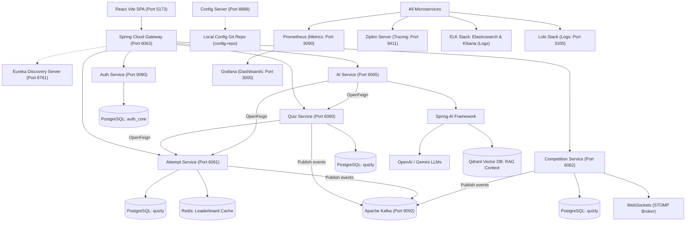

# QuizLY 🧠 — Enterprise-Grade Distributed AI Quiz Platform

QuizLY is a high-performance, resilient, microservice-based AI quiz platform built using Java 21, Spring Boot, Spring Cloud, Kafka, Redis, PostgreSQL, and Spring AI. It features service discovery, centralized configurations, distributed tracing, live WebSockets tournaments, vector-based RAG learning assistance, and automatic PDF-to-quiz synthesis.

---

## 🏗️ System Architecture



---

## ⚡ Infrastructure Port Mapping Matrix

| Service / Infrastructure Component | Port | Description |
|:---|:---|:---|
| **Eureka Server** | `8761` | Service Registry & Registry Dashboard |
| **Config Server** | `8888` | Central git-backed configurations provider |
| **API Gateway** | `6063` | Single entry point, JWT validation & routing |
| **Auth Service** | `9090` | User accounts, credentials, JWT signer, email |
| **Quiz Service** | `6060` | CRUD operations for quizzes, categories, questions |
| **Attempt Service** | `6061` | Logs results, scoring, and hosts Redis sorted set leaderboard |
| **Competition Service** | `6062` | Handles WebSocket matchmaking & live tournament rooms |
| **AI Service** | `6065` | AI generation pipelines, PDF parsing, RAG chatbot |
| **PostgreSQL Database** | `5432` | SQL storage for core services (`quizly` & `auth_core`) |
| **Redis** | `6379` | Fast caching for leaderboards & session records |
| **Apache Kafka** | `9092` | Real-time event broker |
| **Zipkin Distributed Tracing** | `9411` | Trace viewer for request flow visualization |
| **Grafana Dashboard** | `3000` | Analytics frontend interface for Prometheus metrics |

---

## 🛠️ Technology Stack: "What" was used & "Why"

This matrix highlights the design decisions implemented in QuizLY, explaining the engineering rationale behind every technology choice:

| Technology | What it is | Why it was used in QuizLY |
|:---|:---|:---|
| **Spring Cloud Gateway** | API Gateway | Acts as the reverse proxy for all client calls. It handles **JWT verification** in a custom global filter, intercepts invalid requests before they reach downstream servers, and maps endpoints using Eureka load balancing (`lb://`). |
| **Eureka Server** | Service Registry | Provides dynamic registry. Downstream microservices register their hostnames/IPs automatically. This enables client-side load balancing and avoids hardcoding IP addresses in route configurations. |
| **Spring Cloud Config** | Central Config Server | Pulls profiles directly from a dedicated git repository (`config-repo`). Centralizes properties so configuration updates can be propagated globally without rebuilding service JARs. |
| **OpenFeign & Resilience4j** | Declarative HTTP client + Resilience | Simplifies service-to-service calls. Paired with Resilience4j's **Circuit Breaker**, it intercepts network failures when requesting resource information and redirects execution to local fallbacks to avoid cascading service failure. |
| **Apache Kafka** | Distributed Event Queue | Decouples services asynchronously. When a quiz is created or completed, Kafka events are emitted to coordinate messaging, study plans, and notifications without locking application threads. |
| **Redis (Sorted Sets)** | In-Memory Data Store | Stores real-time leaderboards. By using Redis **ZSets** (`ZADD` / `ZREVRANGE`), the system retrieves high-score leaders in `O(log(N))` time complexity instead of hitting disk-bound PostgreSQL databases. |
| **WebSockets (STOMP)** | Real-Time Protocol | Powering the Competition Service arena. Clients subscribe to STOMP topic channels (`/topic/competition/{roomCode}`) for immediate notification of score updates and opponent statuses during tournaments. |
| **Spring AI & Qdrant** | AI & Vector Database | Implements the **RAG (Retrieval-Augmented Generation)** pattern. Uploaded study PDFs are parsed, converted into vector embeddings, and indexed in Qdrant. The AI Service performs similarity searches during chatbot queries to provide verified reference responses. |
| **Zipkin & Micrometer** | Distributed Tracing | Adds diagnostic observability. By injecting transaction IDs into request header bags, we can trace a single API call's network travel downstream across multiple databases and microservices. |
| **Loki, ELK, Prometheus** | Observability Triad | Loki/Elasticsearch aggregates stdout streams, Prometheus scrapes Actuator JVM metrics, and Grafana aggregates these into graphical status monitoring panels. |

---

## 🚀 How to Run the Project

### Prerequisites
- **Java 21 JDK**
- **Node.js** (v18+)
- **Docker & Docker Compose**
- **Maven** 3.8+

### Step 1: Bootstrap Infrastructure
Run Docker Compose to launch all required backing services (PostgreSQL, Redis, Kafka, Qdrant, Prometheus, Zipkin, etc.):
```bash
docker-compose up -d
```
Verify that all database instances and brokers are healthy on their standard ports.

### Step 2: Set up configuration-repo
QuizLY's Config Server is backed by a local Git repository. Navigate to `config-repo` and initialize/verify Git tracking:
```bash
cd config-repo
git init
git add .
git commit -m "Initialize configurations properties files"
cd ..
```
*Note: Config Server expects files to be committed in Git, otherwise it will throw resource loading errors.*

### Step 3: Run the Services (in order)
Start the services in the following order using your IDE (e.g., IntelliJ IDEA) or terminal:
1. **Eureka Server** (`eureka-server`): Runs on `http://localhost:8761`
2. **Config Server** (`config-server`): Runs on `http://localhost:8888`
3. **API Gateway** (`api-gateway`): Runs on `http://localhost:6063`
4. **Auth Service** (`auth-service`): Runs on `http://localhost:9090`
5. **Quiz Service** (`QuizService`): Runs on `http://localhost:6060`
6. **Attempt Service** (`attemptservice`): Runs on `http://localhost:6061`
7. **Competition Service** (`competition-service`): Runs on `http://localhost:6062`
8. **AI Service** (`ai-service`): Runs on `http://localhost:6065`

*To compile and build JARs via terminal, run:*
```bash
mvn clean install -DskipTests
```

### Step 4: Run the UI Frontend
Navigate to the React SPA directory, install packages, and start the development server:
```bash
cd quizly-frontend
npm install
npm run dev
```
Open `http://localhost:5173` in your browser. All API requests are automatically routed via the Axios baseURL client to the Gateway port `6063`.

---

## 🔧 Recent Improvements & Troubleshooting

To make QuizLY more robust, secure, and fully aligned with production microservice standards, the following enhancements were resolved:

1. **Declarative Feign Security Context Propagation**:
   - *Problem*: Downstream microservices (like `attempt-service`) implement strict Broken Object Level Authorization (BOLA) security checks, validating `X-User-Id` request headers against payload user IDs. Since OpenFeign clients in `ai-service` and `QuizService` were making calls without propagating these headers, requests triggered fallback triggers (returning empty lists or failing to save attempts).
   - *Solution*: Modified Feign Client interfaces (`AttemptServiceClient`, `AttemptClient`) to accept `@RequestHeader("X-User-Id")` parameters, passing authorization context downstream dynamically.
2. **AI Quiz Generation Format Alignment**:
   - *Problem*: The AI Quiz Generator prompts and static fallbacks in `ai-service` generated quiz objects where the `correctAnswer` key held the raw answer text (e.g. `"Centralized configuration management"`). Standard admin-generated quizzes store `correctAnswer` as option keys (`"optionA"`, `"optionB"`, etc.). Mismatched formats caused client score evaluations to fail and return `0`.
   - *Solution*: Rewrote the LLM prompt instructions and the mock JSON fallback configurations in `FallbackAiConfig` to guarantee output of option keys (`optionA`/`optionB`/`optionC`/`optionD`) for `correctAnswer`.
3. **Robust WebSocket Payload Parsing**:
   - *Problem*: In `LobbyWebSocketController`, incoming payloads from Stomp frames were directly cast via `((Number) payload.get("userId")).longValue()`, causing `ClassCastException` failures if parameters were sent as strings.
   - *Solution*: Implemented robust utility parsing methods (`getLongValue` and `getIntegerValue`) validating object types before casting, preventing socket connection drops.

---

## 🎨 UI & Backend Connections


- **Authentication**: Login/Register requests hit `http://localhost:6063/auth/login` and `http://localhost:6063/auth/register`. A successful login returns a JWT token stored in `localStorage`, which is dynamically injected as an `Authorization: Bearer <token>` header in all subsequent API calls via Axios interceptors.
- **AI Hub**: The interface routes requests to `/api/ai/**`, which is mapped to the AI Service through the Gateway. Here, users can ask questions to the RAG chat engine, upload a study PDF, evaluate the difficulty of questions, and get automated study guides based on their microservice progress history.
- **Live Competitions**: Opponents pair up using match codes and establish connection channels via `/ws` WebSocket handshakes, communicating using standard STOMP topics.

---

## 🚀 DevOps & Observability Infrastructure

QuizLY comes packaged with complete DevOps configurations and observability setups under the [devops/](file:///d:/Project/QuizLY/devops) folder. This includes:

- **Docker-Compose backing services**: Databases, event brokers, and tracing engines (PostgreSQL, Redis, Kafka, Qdrant, Zipkin).
- **Log Aggregation Stack**: Promtail & Loki configuration alongside Logstash pipelines for ELK.
- **Monitoring & Metrics**: Prometheus scraping configurations and preconfigured Grafana metrics dashboards.
- **Kubernetes Deployment manifests**: Complete declarations (`secrets`, `configmaps`, `ingress`, databases, and stateless microservice Deployments) optimized with liveness/readiness probes.

For detailed information on the layout, configuration details, and running of the DevOps stack, refer to the [DevOps and Observability Guide](file:///d:/Project/QuizLY/devops/README.md)...

